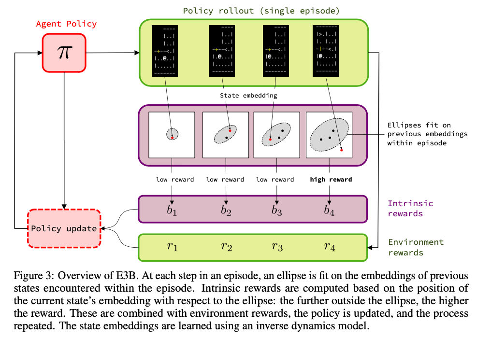

# Exploration via Elliptical Episodic Bonuses

This repo contains code for the E3B algorithm described in the NeurIPS 2022 paper [Exploration via Elliptical Episodic Bonuses](https://arxiv.org/abs/2210.05805) by Mikael Henaff, Roberta Raileanu, Minqi Jiang and Tim Rocktäschel. 

E3B is an exploration algorithm designed for contextual MDPs, where the environment changes every episode. Examples of contextual MDPs include procedurally-generated environments such as MiniGrid, MiniHack, NetHack, ProcGen, and embodied AI settings such as Habitat where the agent finds itself in a new indoor space each episode.

The algorithm is simple to implement and operates using an elliptical bonus computed at the episode level, in a feature space induced by an inverse dynamics model.




## Running the code

Code to run E3B on MiniHack and Vizdoom uses IMPALA as the base RL algorithm and is contained in the `minihack` folder. Code to run E3B on Habitat uses DD-PPO and is in the `habitat-lab` folder. Please see the README files in each folder for further instructions.

## Citation

If you use this code in your work, please cite the following:

```
@inproceedings{E3B,
  title     =     {Exploration via Elliptical Episodic Bonuses},
  author    =     {Mikael Henaff and Roberta Raileanu and Minqi Jiang and Tim Rocktäschel},
  booktitle =     {Advances in Neural Information Processing Systems (NeurIPS)},
  year      =     {2022}
}
```

## Acknowledgements

This repo is built on the [Torchbeast](https://github.com/facebookresearch/torchbeast) code. We also use parts of the [RIDE](https://github.com/facebookresearch/impact-driven-exploration) and [NovelD](https://github.com/tianjunz/NovelD) codebases for baselines.

## License

The majority of this project is licensed under CC-BY-NC, however portions of the project are available under separate license terms: NovelD is licensed under the Apache 2.0 license.


